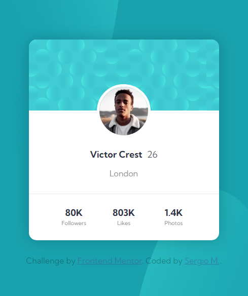

# Frontend Mentor - Profile card component solution

This is a solution to the [Profile card component challenge on Frontend Mentor](https://www.frontendmentor.io/challenges/profile-card-component-cfArpWshJ). Frontend Mentor challenges help you improve your coding skills by building realistic projects. 

## Table of contents

- [Overview](#overview)
  - [The challenge](#the-challenge)
  - [Screenshot](#screenshot)
  - [Links](#links)
- [My process](#my-process)
  - [Built with](#built-with)
- [Author](#author)

## Overview

### The challenge

- Build out the project to the designs provided

### Screenshot

### Screenshot it's mine

### Links

- Live Site URL: [Add live site URL here](https://sergio-ivan-melgarejo.github.io/Front-Mentor-02/)

## My process

### Built with

- Semantic HTML5 markup
- CSS custom properties
- Flexbox
- Mobile-first workflow

## Author

- Website - [GitHub Profile](https://github.com/Sergio-Ivan-Melgarejo)
- Frontend Mentor - [@Sergio-Ivan-Melgarejo](https://www.frontendmentor.io/profile/Sergio-Ivan-Melgarejo)